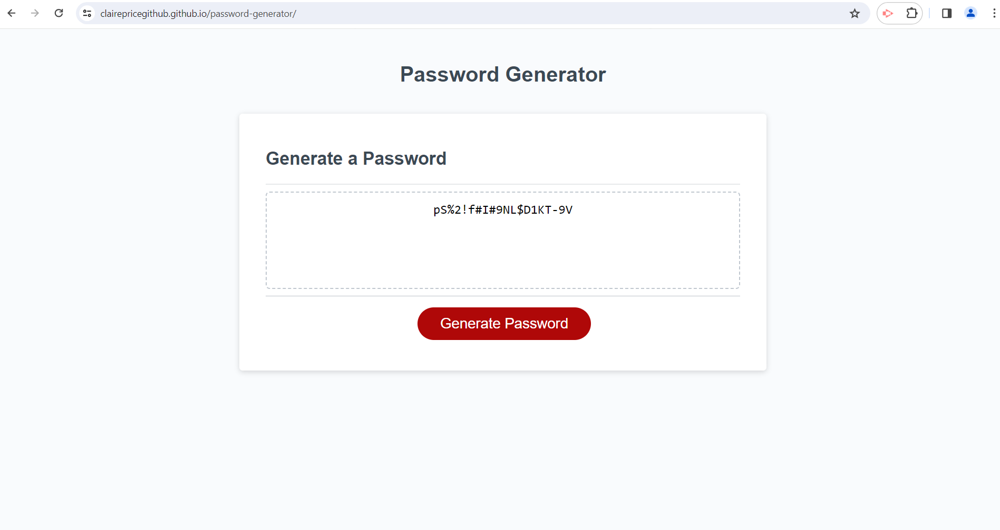

# Password Generator

## Description
Project to build a password generator that runs in the browser, powered by JavaScript. This generator allows a completely random password to be produced, with options for upper and lower case characters, special characters and numeric characters. The generator also allows for password length to be inputted. These options mean password requirements can easily be inputted to produce an instant random password

HTML and CSS starter code was provided, along with JavaScript function names to break down functions within the JavaScript file. I wrote code within the function names to build the password generator

During this project I developed my knowledge of creating functions and using built-in methods and arrays. I also practised combining these tools to create the desired effect, while also refactoring to produce clean, readable code.  I carried out extensive research to find the most appropriate tools to use for this purpose

## Installation

N/A

## Usage

Click the generate password button and follow instructions in the popup boxes. Password is written to the page

https://clairepricegithub.github.io/password-generator/

## Credits

index.js lines 167-186:  
Stack Overflow. 2012, July 2. *Return index of greatest value in an array*. https://stackoverflow.com/questions/11301438/return-index-of-greatest-value-in-an-array

## License

Please refer to the LICENSE in the repo
